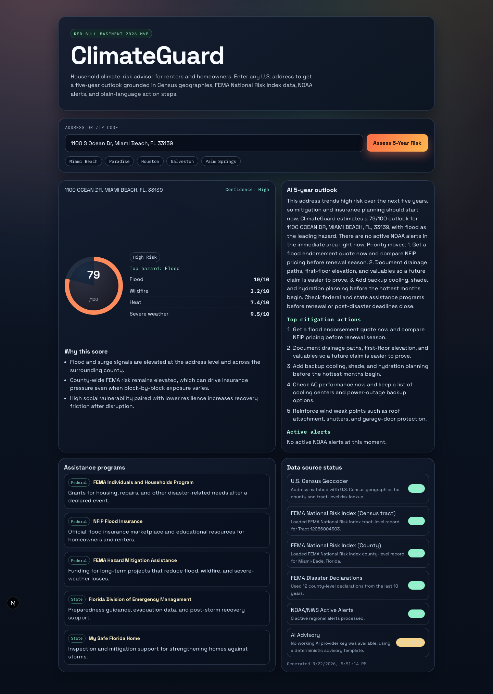
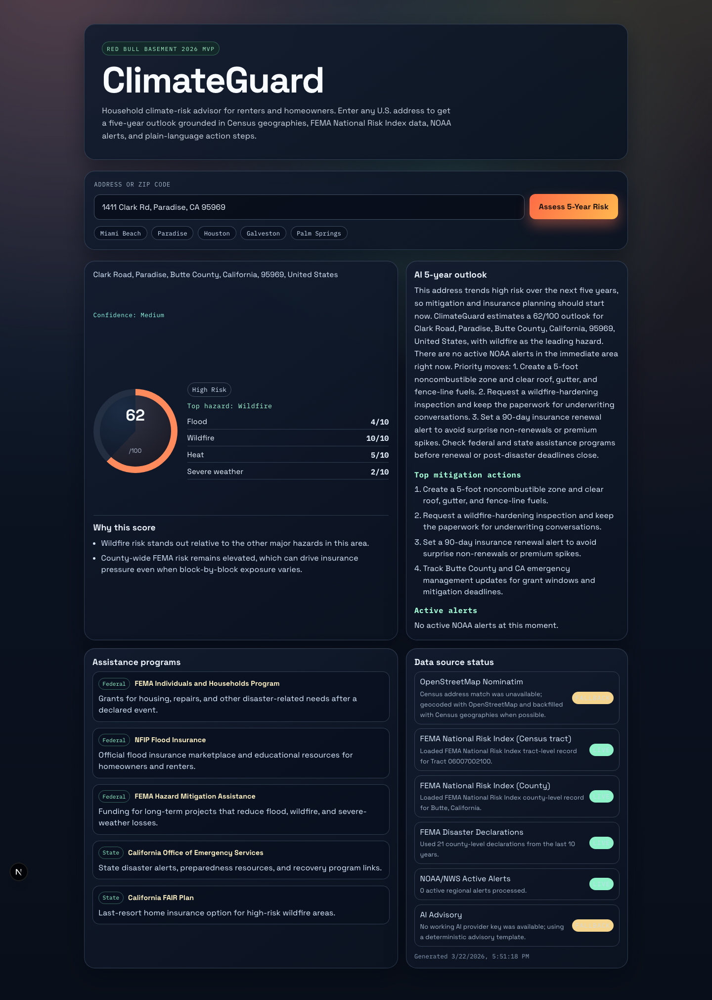
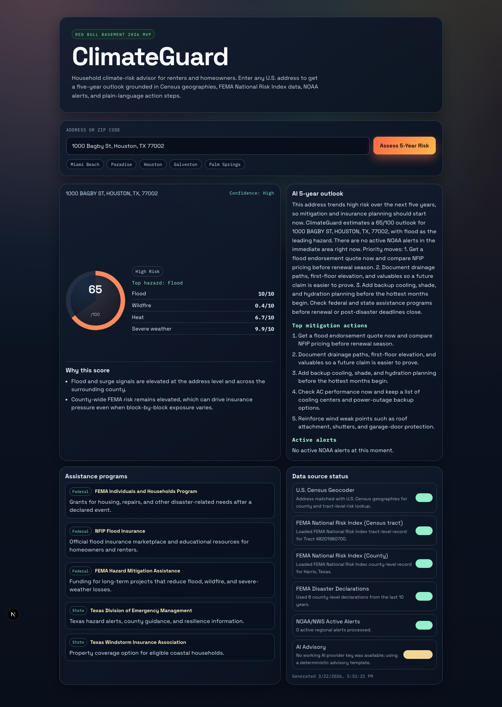

# ClimateGuard | Red Bull Basement 2026 MVP

🌐 **Live Demo:** [climateguard-redbull-basement-2026.vercel.app](https://climateguard-redbull-basement-2026.vercel.app)

ClimateGuard is a full-stack Next.js MVP for **Red Bull Basement 2026**.
It turns one U.S. address into a plain-language **5-year climate-risk outlook** with hazard scores, active alerts, mitigation actions, and assistance links.

**Production path:** Azure OpenAI (`gpt-4o`)  
**Demo fallback:** Gemini  
**Tertiary fallback:** NVIDIA NIM

## Why this project is competition-ready

- Solves a real household problem: climate risk usually becomes obvious only when insurance gets harder or disaster is already near.
- Uses public U.S. data sources that are easy to explain in a one-minute demo.
- Translates raw risk inputs into an actionable checklist instead of a dashboard.
- Ships with a validation set, screenshots, pitch docs, and demo runbook.

## What the MVP does

- Address-first workflow for renters and homeowners.
- Geocodes to U.S. Census tract and county where possible.
- Computes a composite 5-year score from:
  - Flood
  - Wildfire
  - Heat
  - Severe weather
- Shows active NOAA/NWS alerts near the address.
- Generates a plain-English advisory with prioritized actions.
- Links users to federal and state assistance programs.
- Exposes source status for every data provider used in the response.

## Data sources used now

- U.S. Census Geocoder
- OpenStreetMap Nominatim
- FEMA National Risk Index
- FEMA OpenFEMA disaster declarations
- NOAA / National Weather Service active alerts

## Demo Outputs





## Sponsor Hook

- **Azure path:** ClimateGuard is wired for Azure OpenAI in production and can fall back to Gemini or NVIDIA NIM for demo resilience.
- **Compute angle:** The scoring path is built around fast tract and county hazard lookups that can scale on AMD-backed cloud infrastructure.
- **Judging angle:** The app is easy to demo live because one request returns a score, top hazard, active alerts, actions, and assistance links.

## Tech stack

- Next.js 16 (App Router, TypeScript)
- React 19
- `zod` for API validation
- Native `fetch` for federal data and AI provider calls

## Quick start

```bash
npm install
cp .env.example .env.local
npm run dev
```

Open `http://localhost:3000`

## Environment variables

Set these in `.env.local`:

```bash
# Primary production path
AZURE_OPENAI_ENDPOINT=
AZURE_OPENAI_KEY=
AZURE_OPENAI_DEPLOYMENT=gpt-4o
AZURE_OPENAI_API_VERSION=2024-02-01

# Demo fallback
GEMINI_API_KEY=
GEMINI_MODEL=gemini-2.0-flash

# Optional tertiary fallback
NVIDIA_NIM_API_KEY=
NVIDIA_NIM_BASE_URL=https://integrate.api.nvidia.com/v1
NVIDIA_NIM_MODEL=meta/llama-3.3-70b-instruct
```

You only need **one** working AI provider key for LLM-generated advisories.
If no key is configured, ClimateGuard still works and falls back to a deterministic advisory template.

## API

### `POST /api/risk`

Request body:

```json
{
  "address": "1100 S Ocean Dr, Miami Beach, FL 33139"
}
```

Response includes:

- `fiveYearRiskScore` (0-100)
- `riskLevel` (`Low|Moderate|High|Severe`)
- `breakdown` (`flood`, `wildfire`, `heat`, `severeWeather`)
- `topHazard`
- `activeAlerts`
- `advisory`
- `actions`
- `assistancePrograms`
- `dataSources`

## Validation workflow

Run:

```bash
npm run validate:addresses
```

The script will start a local app instance if needed, then read `data/test-addresses.csv` and write `data/validation-output.json` with completion, dominant-hazard match rate, and per-address outputs.

## Submission assets

- `docs/pitch-script.md`
- `docs/problem-story.md`
- `docs/judges-one-pager.md`
- `docs/reviewer-guide.md`
- `docs/submission-copy.md`
- `docs/validation-plan.md`
- `docs/demo-runbook.md`
- `data/test-addresses.csv`

## Build and quality checks

```bash
npm run lint
npm run build
npm run reviewer:check
npm run screenshots
```

## Stress testing

Run the reproducible smoke profile:

```bash
CLIMATEGUARD_STRESS_PROFILE=smoke npm run stress
```

Run failover smoke test:

```bash
FAILOVER_STRESS_DURATION_SEC=15 FAILOVER_STRESS_CONCURRENCY=4 npm run stress:failover
```

## Deploy

Recommended: Vercel

1. Import this repo into Vercel.
2. Add an Azure OpenAI, Gemini, or NVIDIA NIM secret if you want model-generated advisories in production.
3. Deploy.

Without an AI secret, the deployed app still returns deterministic advisory text.

## Notes

- ClimateGuard is a decision-support MVP, not a legal or underwriting system.
- The current model intentionally prioritizes explainable public data over proprietary insurance datasets.
